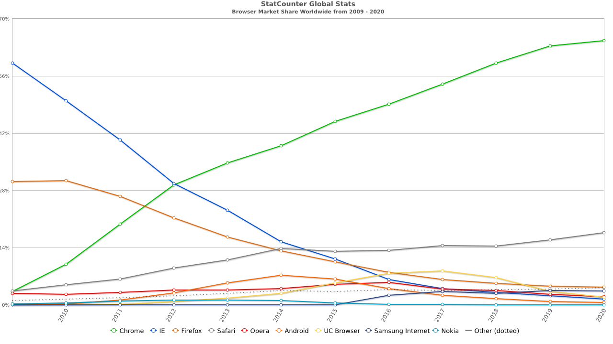
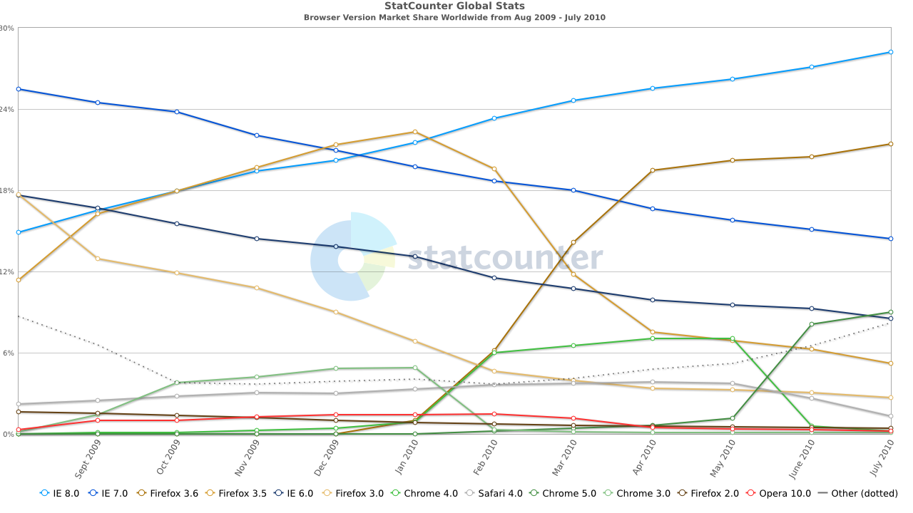
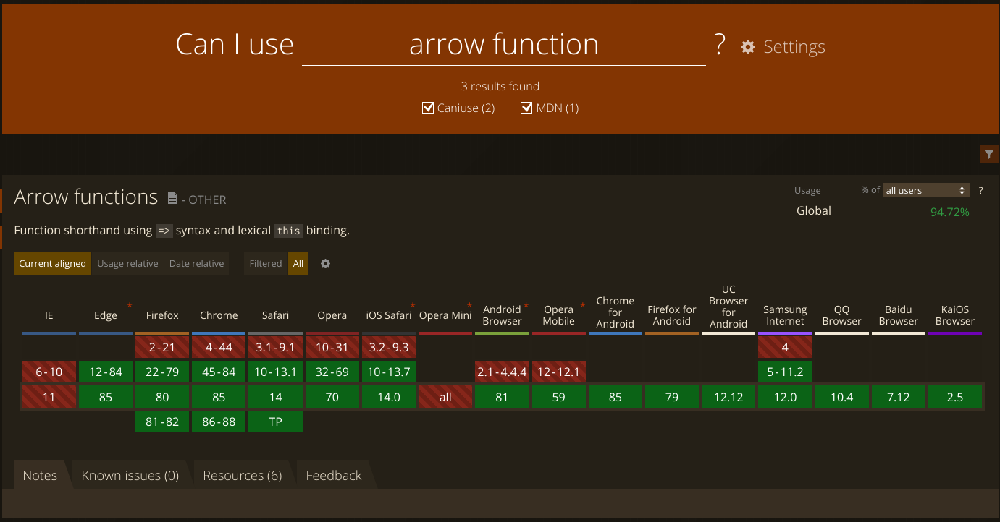

# Écosystème

----

Disclaimer :

- non-exhaustif
- subjectif

---

## Histoire

note:

Focus sur la partie frontend, parce qu'historiquement JS a été fait pour ça

jusqu'en en 2008, il y avait 2~4 navigateurs à supporter

les browsers étaient rarement mit à jours

puis est arrivé Chrome ...

----

<small>

[gs.statcounter.com/browser-market-share#yearly-2009-2020](https://gs.statcounter.com/browser-market-share#yearly-2009-2020)

</small>

----

<small>

[gs.statcounter.com/browser-version-market-share#monthly-200908-201007](https://gs.statcounter.com/browser-version-market-share#monthly-200908-201007)

</small>

note:

Chrome a bousculé le web avec de nouvelles **versions très fréquentes** _ET_ avec un système de **mise à jour automatique**

Les concurrents ont été obligés d'adopter ce nouveau rythme

----

> bidule.com est cassé sur MachinBrowser alors que ça marche bien sur Chrome, donc Chrome est mieux, CQFD

_User Lambda_

note:

Chrome était **moins stricte** que les autres

et incluait de **nouvelles API**, que certains dev s'empressaient d'utiliser

certains sites étaient "optimisé pour Chrome"

----

🥚↔️🐔

note:

Sans savoir qui a été le premier de l'oeuf ou de la poule entre :

- des besoins grandissants
- des browsers avec plus de fonctionnalités
- de meilleurs outils

Certainement un mélange de tout ça dans le contexte du moment

C'est vers cette période que les sites ont commencé à avoir de plus en plus de fonctionnalités coté frontend directement en HTML / CSS / JS

Sans avoir besoin de Flash, Silverlight, applet Java ...

Tout s'est accéléré dans l'écosystème

---

## Un problème systémique

|                         | MàJ programme |   MàJ env    | Stabilité |
| :---------------------- | :-----------: | :----------: | :-------: |
| client lourd installer  |    👨 user     | ⚙️ installer |     🙂     |
| client lourd executable |    👨 user     |   📦 inclut   |     🙂     |
| server                  |     🤓 dev     |    🧔 ops     |     🙂     |
| web app                 |     🤓 dev     |    👨 user    |     😕     |

note:

Définitions :

- environnement : dépendances, interpréteur ... tout ce qui est nécessaire au fonctionnement du programme
- client lourd installer : un programme qui s'éxécute sur le poste de l'user après l'installation
- client lourd executable : un programme qui s'éxécute sur le poste de l'user sans avoir besoin de l'installer (parfois appelé "version portable"), tout l'environnement nécessaire au fonctionnement du programme est inclut dans le fichier éxécutable
- ops : opérateur, sys admin

Commentaire :

- Client lourd installer : env maitrisé lors de l'installation (ex : Apt, RPM, choco, brew ...)
- Client lourd executable : env maitrisé lors du packaging du programme (ex : AppImage)
- Serveur : env maitrisé par l'entreprise ou ses partenaires, avec lesquels ces questions sont encadrés via des contrats
- web app : user choisit de mettre à jour ou non son web browser

pour une web app, il faut donc définir sa cible de rétro compatibilité

----

### Rétrocompatibilité maitrisée

note:

Comment maitriser cette rétro compatibilité ?

----

https://caniuse.com/

note:

savoir si une API est disponible dans les web browsers qu'on cible

----

https://kangax.github.io/compat-table/es6/

note:

savoir si une fonctionnalité du langage est disponible dans les web browsers qu'on cible

----

#### Polyfill

[core-js](https://github.com/zloirock/core-js)

note:

JS est un langage très permissif, lorsque une API n'est pas présente dans l'environnement ciblé, il est parfois possible d'ajouter un `polyfill`

transparent et confortable pour les dev

`polyfill` : c'est un bout de programme qui permet de simuler une nouvelle API avec des anciennes API

ex : `Array.prototype.includes()`, `Array.isArray()`

le plus connu est actuellement `core-js`

----

#### Transpiler

|                          |  JS   | Type  | => JS |
| :----------------------- | :---: | :---: | :---: |
| Babel                    |   ✅   |   ❌   |   ✅   |
| TypeScript / Flow        |   ✅   |   ✅   |   ✅   |
| CoffeeScript / ELM / ... |   ❌   |   🤷   |   ✅   |
| Rust / Clojure / ...     |   ❌   |   🤷   |   ❌   |

note:

parfois ce n'est pas une API qui est manquante mais une fonctionnalité du langage

normalement du code écrit dans un `langage informatique` ça sert à communiquer à un autre dev ce qu'on voudrait que la machine fasse à notre place

- Compiler : langage informatique => langage machine
- Transpiler : langage informatique => langage informatique

`=> JS` langage qui a été conçu pour etre transpilé en JS

---

## Aperçu de l'écosystème

https://github.com/ManzDev/frontend-evolution

note:

Components:

- Google polymer <-> dev Chrome, lib simple dont le but était de disparaître au profit de nouveaux standards
- Google Angular <-> dev AdSense, framework séduisant pour les devs venant de Spring
- Facebook React
- Vue
- Svelte
